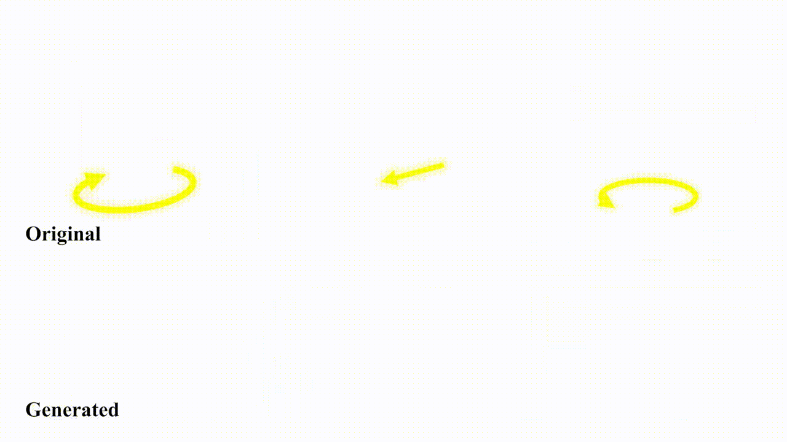

# FlexAM: Flexible Appearance-Motion Decomposition for Versatile Video Generation Control


## NEWS:
- Feb 13, 2026: inference code and comfyui

## Quickstart

### Create environment
1. Clone the repository and create conda environment: 

    ```
    git clone https://github.com/Sandwich-2020/FlexAM.git
    conda create -n flexam python=3.10
    conda activate flexam
    ```

2. Install pytorch, we recommend `Pytorch 2.5.1` with `CUDA 12.1`:

    ```
    pip install torch==2.5.1 torchvision==0.20.1 --index-url https://download.pytorch.org/whl/cu121
    ```


3. Make sure the submodule and requirements are installed:
    ```
    mkdir -p submodules
    git submodule update --init --recursive
    pip install -r requirements.txt
    ```
    If the submodules are not installed, you need to manually download them and move them to `submodules/`. Run the following commands to install the submodules:
    ```
    # DELTA
    git clone https://github.com/snap-research/DELTA_densetrack3d.git submodules/MoGe
    # Pi3
    git clone https://github.com/yyfz/Pi3.git submodules/Pi3
    # MoGe
    git clone https://github.com/microsoft/MoGe.git submodules/MoGe
    # VGGT
    git clone https://github.com/facebookresearch/vggt.git submodules/vggt
    ```

4. Manually download these checkpoints to `checkpoints/`:
   - Our *FlexAM* checkpoint: https://huggingface.co/SandwichZ/Wan2.2-Fun-5B-FLEXAM


### Inference

The inference code was tested on

- Ubuntu 20.04
- Python 3.10
- PyTorch 2.5.1
- 1 NVIDIA A800 with CUDA version 12.1. 

We provide a inference script for our tasks. Please refer to 'run_demo.sh' to run the `demo.py` script.

Or you can run these tasks one by one as follows.

#### 1. Motion Transfer 

---

```python
python demo.py \
    --prompt <"prompt text"> \ # prompt text
    --checkpoint_path <model_path> \ # FlexAM checkpoint path (e.g checkpoints/Diffusion_Transformer/Wan2.2-Fun-5B-FLEXAM)
    --output_dir <output_dir> \ # output directory
    --input_path <input_path> \ # the reference video path
    --repaint <True/repaint_path > \ # the repaint first frame image path of input source video or use FLUX to repaint the first frame \
    --video_length=97 \ 
    --sample_size 512 896 \
    --generate_type='full_edit' \
    --density 10 \ # Control the sparsity of tracking points
    --gpu <gpu_id> \ # the gpu id
```


#### 2. foreground edit

```python
python demo.py \
    --prompt <"prompt text"> \ # prompt text
    --checkpoint_path <model_path> \ # FlexAM checkpoint path (e.g checkpoints/Diffusion_Transformer/Wan2.2-Fun-5B-FLEXAM)
    --output_dir <output_dir> \ # output directory
    --input_path <input_path> \ # the reference video path
    --repaint <True/repaint_path > \ # the repaint first frame image path of input source video or use FLUX to repaint the first frame \
    --mask_path <mask_path> \ # White (255) represents the foreground to be edited, and black (0) remains unchanged
    --video_length=97 \ 
    --sample_size 512 896 \
    --generate_type='foreground_edit' \ 
    --dilation_pixels=30 \ # Dilation pixels for mask processing in foreground_edit mode
    --density 10 \ # Control the sparsity of tracking points
    --gpu <gpu_id> \ # the gpu id
```

#### 3. background edit

```python
python demo.py \
    --prompt <"prompt text"> \ # prompt text
    --checkpoint_path <model_path> \ # FlexAM checkpoint path (e.g checkpoints/Diffusion_Transformer/Wan2.2-Fun-5B-FLEXAM)
    --output_dir <output_dir> \ # output directory
    --input_path <input_path> \ # the reference video path
    --repaint <True/repaint_path > \ # the repaint first frame image path of input source video or use FLUX to repaint the first frame \
    --mask_path <mask_path> \ # White (255) represents the unchanged foreground, while the background indicates the area to be edited
    --video_length=97 \ 
    --sample_size 512 896 \
    --generate_type='background_edit' \
    --density 10 \ # Control the sparsity of tracking points
    --gpu <gpu_id> \ # the gpu id
```

#### 4. Camera Control


We provide three camera control methods: 1. Use predefined templates; 2. Use a pose text file (pose txt); 3. Input another video, where the "Pi3" automatically estimates the camera pose from it and applies it to the video to be generated.

##### 1. Use predefined templates

We provide several template camera motion types, you can choose one of them. In practice, we find that providing a description of the camera motion in prompt will get better results.
```python
python demo.py \
    --prompt <"prompt text"> \ # prompt text
    --checkpoint_path <model_path> \ # FlexAM checkpoint path (e.g checkpoints/Diffusion_Transformer/Wan2.2-Fun-5B-FLEXAM)
    --output_dir <output_dir> \ # output directory
    --input_path <input_path> \ # the reference image or video path
    --camera_motion <camera_motion> \ # the camera motion type, see examples below
    --tracking_method <tracking_method> \ # the tracking method (moge, DELTA). For image input, 'moge' is necessary.
    --override_extrinsics <override/append> \ # how to apply camera motion: "override" to replace original camera, "append" to build upon it
    --video_length=97 \ 
    --sample_size 512 896 \    
    --density 5 \ # Control the sparsity of tracking points
    --gpu <gpu_id> \ # the gpu id
```

Here are some tips for camera motion:
- trans: translation motion, the camera will move in the direction of the vector (dx, dy, dz) with range [-1, 1]
  - Positive X: Move left, Negative X: Move right
  - Positive Y: Move down, Negative Y: Move up
  - Positive Z: Zoom in, Negative Z: Zoom out
  - e.g., 'trans -0.1 -0.1 -0.1' moving right, down and zoom in
  - e.g., 'trans -0.1 0.0 0.0 5 45' moving right 0.1 from frame 5 to 45
- rot: rotation motion, the camera will rotate around the axis (x, y, z) by the angle
  - X-axis rotation: positive X: pitch down, negative X: pitch up
  - Y-axis rotation: positive Y: yaw left, negative Y: yaw right
  - Z-axis rotation: positive Z: roll counter-clockwise, negative Z: roll clockwise
  - e.g., 'rot y 25' rotating 25 degrees around y-axis (yaw left)
  - e.g., 'rot x -30 10 40' rotating -30 degrees around x-axis (pitch up) from frame 10 to 40
- spiral: spiral motion, the camera will move in a spiral path with the given radius
  - e.g., 'spiral 2' spiral motion with radius 2
  - e.g., 'spiral 2 15 35' spiral motion with radius 2 from frame 15 to 35

Multiple transformations can be combined using semicolon (;) as separator:
- e.g., "trans 0 0 -0.5 0 30; rot x -25 0 30; trans -0.1 0 0 30 48"
  This will:
  1. Zoom in (z-0.5) from frame 0 to 30
  2. Pitch up (rotate -25 degrees around x-axis) from frame 0 to 30
  3. Move right (x-0.1) from frame 30 to 48

Notes:
- If start_frame and end_frame are not specified, the motion will be applied to all frames (0-48)
- Frames after end_frame will maintain the final transformation
- For combined transformations, they are applied in sequence


##### 2. Use a pose text file (pose txt)

```python
python demo.py \
    --prompt <"prompt text"> \ # prompt text
    --checkpoint_path <model_path> \ # FlexAM checkpoint path (e.g checkpoints/Diffusion_Transformer/Wan2.2-Fun-5B-FLEXAM)
    --output_dir <output_dir> \ # output directory
    --input_path <input_path> \ # the reference image or video path
    --camera_motion "path" \ # if camera motion type is "path", --pose_file is needed
    --pose_file <pose_file_txt> \ # txt file of camera pose, Each line corresponds to one frame
    --tracking_method <tracking_method> \ # the tracking method (moge, DELTA). For image input, 'moge' is necessary.
    --override_extrinsics <override/append> \ # how to apply camera motion: "override" to replace original camera, "append" to build upon it
    --video_length=97 \ 
    --sample_size 512 896 \    
    --density 5 \ # Control the sparsity of tracking points
    --gpu <gpu_id> \ # the gpu id
```

##### 3. Input another video for extract camera pose

```python
python demo.py \
    --prompt <"prompt text"> \ # prompt text
    --checkpoint_path <model_path> \ # FlexAM checkpoint path (e.g checkpoints/Diffusion_Transformer/Wan2.2-Fun-5B-FLEXAM)
    --output_dir <output_dir> \ # output directory
    --input_path <input_path> \ # the reference image or video path
    --camera_motion "path" \ # if camera motion type is "path", --pose_file is needed
    --pose_file <pose_file_mp4> \ # "Pi3" automatically estimates the camera pose from this video file 
    --tracking_method <tracking_method> \ # the tracking method (moge, DELTA). For image input, 'moge' is necessary.
    --override_extrinsics <override/append> \ # how to apply camera motion: "override" to replace original camera, "append" to build upon it
    --video_length=97 \ 
    --sample_size 512 896 \    
    --density 5 \ # Control the sparsity of tracking points
    --gpu <gpu_id> \ # the gpu id
```


#### 5. Object Manipulation

We provide several template object manipulation types, you can choose one of them. In practice, we find that providing a description of the object motion in prompt will get better results.
```python
python demo.py \
    --prompt <"prompt text"> \ # prompt text
    --checkpoint_path <model_path> \ # FlexAM checkpoint path (e.g checkpoints/Diffusion_Transformer/Wan2.2-Fun-5B-FLEXAM)
    --input_path <input_path> \ # the reference image path
    --object_motion <object_motion> \ # the object motion type (up, down, left, right)
    --object_mask <object_mask_path> \ # the object mask path
    --tracking_method <tracking_method> \ # the tracking method (moge, DELTA). For image input, 'moge' is nesserary.
    --sample_size 512 896 \
    --video_length=49 \
    --density 30 \    
    --gpu <gpu_id> \ # the gpu id
```
It should be noted that depending on the tracker you choose, you may need to modify the scale of translation.


## Acknowledgements

This project builds upon several excellent open source projects:

* [VideoX-Fun](https://github.com/aigc-apps/VideoX-Fun)

* [DELTA](https://github.com/snap-research/DELTA_densetrack3d)

* [MoGe](https://github.com/microsoft/MoGe)

* [vggt](https://github.com/facebookresearch/vggt)

* [Pi3](https://github.com/yyfz/Pi3)

We thank the authors and contributors of these projects for their valuable contributions to the open source community!


